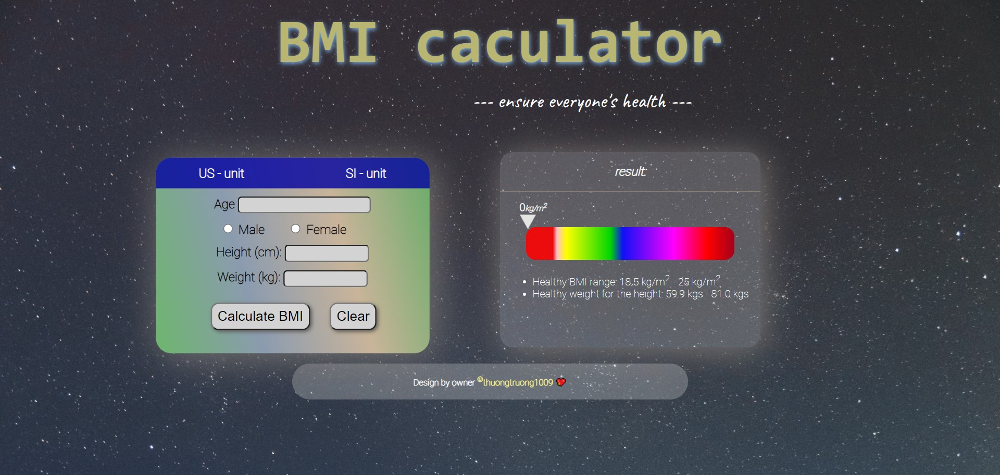

<h1 align="center">BMI CALCULATOR</h1>

## Demo
+ Preview at [here](https://bmitool.netlify.app/)

## Contribute
+ star this repo
+ click fork button
+ clone to your local
+ and make new Pull Request on your new branch
+ Congratulate, you have just contribute to them.

## Refer
+ Learning front-end web full course at [Front-end course](https://github.com/thuongtruong1009/challenge-resposive-web-design).
+ Learn Snake Game tutorial at [Snake-Game-OOP](https://github.com/thuongtruong1009/Snake-Game-OOP)
+ Learn Java for new beginner at [Java training](https://github.com/thuongtruong1009/java-oop-training)
+ Make flip card game at [flip-card](https://github.com/thuongtruong1009/flip-cards)
+ Learn computer architecture at [architecture](https://github.com/thuongtruong1009/computer-architecture)
+ Pratice UI/UX at [league-fo-legend](https://github.com/thuongtruong1009/league-of-legends-clone)

---
## ❤️ [Support me](https://www.paypal.me/thuongtruong1009)
> We are looking for sponsors to join us to have better community reach and impact.

## 📰 [License](LICENSE)
+ ##### This project is distributed under the [MIT License](LICENSE).
+ ##### Copyright of [@thuongtruong1009](https://github.com/thuongtruong1009), 2021.
